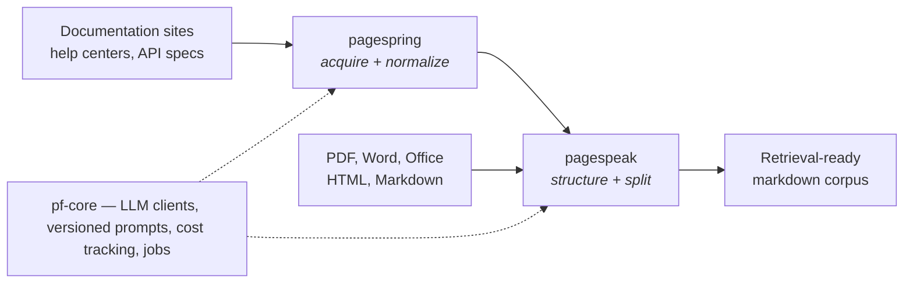

# Phierce Web

Open-source Python tooling for LLM applications, built by [Mike Farr](https://www.linkedin.com/in/mike-farr-slc/).

Currently, multiple projects built on the same. **pf-core** is the foundation; **pagespeak** and **pagespring** are built on it. Several others are in the works, including an automated slide deck generator.

---

### [pf-core](https://github.com/phierceweb/pf-core) · `pip install pf-core`

A Python foundation for building LLM applications whose prompts and spend you can actually see. Every prompt lives in versioned configuration, and every call is recorded — prompt version, model, provider, response, tokens, cost — and replayable, in SQLite, MySQL, or Postgres.

The landscape solves each of those concerns separately: one product routes calls across providers, another traces them, another versions prompts, another runs evals. Stitch several together and no shared key joins a prompt version to the tokens it burned or the validation it failed. pf-core is those concerns designed as one system.

Budgets are checked before the call and a cache refuses to pay twice for identical work. Approved runs promote into a golden set that a new model or prompt replays against before it ships. Long batch jobs resume after a crash instead of starting over. One interface covers OpenRouter, the Anthropic SDK, and Claude Code, so a batch can route onto a local Claude Max session at no per-call cost and still be tracked the same way.

The base install is dependency-light; the LLM, database, and web tiers install independently of each other.

### [pagespeak](https://github.com/phierceweb/pagespeak) · `pip install pagespeak`

Converts documents into small, retrievable markdown that stays intelligible to an LLM at minimal token cost.

The hard part isn't conversion, it's structure. pagespeak uses existing converters — Marker and Docling for PDFs, others for non-PDF formats — and mechanically repairs the heading corruptions each one is known to produce. It can blend them, too: Marker produces deeper hierarchy, Docling cleaner tables.

Sections are cut on hierarchy rather than size, and each chunk carries breadcrumbs back to its parent sections, so the model can tell where a chunk sits and not just what it says. Images can optionally go to a vision model, which decides whether one is a diagram worth converting to Mermaid.

It's the ingestion and structuring stage of a retrieval pipeline and stops there — no embeddings, no vector storage, no query layer. Pair it with your own.

### [pagespring](https://github.com/phierceweb/pagespring) · `pip install pagespring`

The acquisition front end to pagespeak. Point it at a manual's URL: a pattern recognizes the source type, acquires the raw pages, and normalizes them into one clean file with absolute asset URLs. Converting the result is pagespeak's job.

For publicly available documentation only — vendor manuals, help centers, open textbooks, API specs. No login handling, no paywall traversal, no bot-detection evasion. It identifies itself, honors `429 Retry-After`, backs off on server errors, paces its requests, and caps crawl size. Closer to "Save Page As" than to an autonomous crawler.

---

All MIT licensed.

### About

I'm a software architect and engineering manager. These are built nights and weekends. I hope others find these tools useful. I welcome collaboration. 

[LinkedIn](https://www.linkedin.com/in/mike-farr-slc/)
