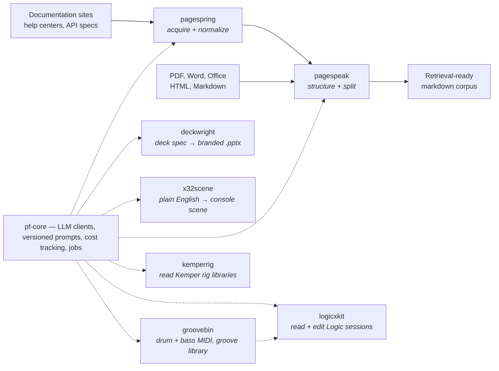

# Phierce Web

Open-source Python tooling for LLM applications and music tech, built by [Mike Farr](https://www.linkedin.com/in/mike-farr-slc/).

Several projects on one foundation. **pf-core** is that foundation; **pagespeak**, **pagespring**, **deckwright**, **x32scene**, **logicxkit**, **groovebin** and **kemperrig** are built on it. More are in the works.

---

### [pf-core](https://github.com/phierceweb/pf-core) · `pip install pf-core`

A Python foundation for building LLM applications whose prompts and spend you can actually see. Every prompt lives in versioned configuration, and every call is recorded — prompt version, model, provider, response, tokens, cost — and replayable, in SQLite, MySQL, or Postgres.

The landscape solves each of those concerns separately: one product routes calls across providers, another traces them, another versions prompts, another runs evals. Stitch several together and no shared key joins a prompt version to the tokens it burned or the validation it failed. pf-core is those concerns designed as one system.

Budgets are checked before the call and a cache refuses to pay twice for identical work. Approved runs promote into a golden set that a new model or prompt replays against before it ships, and `pf-eval` exits non-zero when that replay fails, so CI can block the merge. Long batch jobs resume after a crash instead of starting over. One interface covers OpenRouter, the Anthropic SDK, and Claude Code, so a batch can route onto a local Claude Max session at no per-call cost and still be tracked the same way.

The base install is dependency-light; the LLM, database, and web tiers install independently of each other.

### [pagespeak](https://github.com/phierceweb/pagespeak) · `pip install pagespeak`

Converts documents into small, retrievable markdown that stays intelligible to an LLM at minimal token cost.

The hard part isn't conversion, it's structure. pagespeak uses existing converters — Marker and Docling for PDFs, others for non-PDF formats — and mechanically repairs the heading corruptions each one is known to produce. It can blend them, too: Marker produces deeper hierarchy, Docling cleaner tables.

Sections are cut on hierarchy rather than size, and each chunk carries breadcrumbs back to its parent sections, so the model can tell where a chunk sits and not just what it says. Images can optionally go to a vision model, which decides whether one is a diagram worth converting to Mermaid.

It's the ingestion and structuring stage of a retrieval pipeline and stops there — no embeddings, no vector storage, no query layer. Pair it with your own.

### [pagespring](https://github.com/phierceweb/pagespring) · `pip install pagespring`

The acquisition front end to pagespeak. Point it at a manual's URL: a pattern recognizes the source type, acquires the raw pages, and normalizes them into one clean file with absolute asset URLs. Converting the result is pagespeak's job. It recognizes the platform a manual is published with, and for many of them — mdBook, MadCap Flare, Antora, Starlight and others — acquires the pages in the order the manual's own table of contents gives them. `ingest --batch` takes a file of URLs, one manual per line.

For publicly available documentation only — vendor manuals, help centers, open textbooks, API specs. No login handling, no paywall traversal, no bot-detection evasion. It identifies itself, honors `429 Retry-After`, backs off on server errors, paces its requests, and caps crawl size. Closer to "Save Page As" than to an autonomous crawler.

### [deckwright](https://github.com/phierceweb/deckwright) · `git clone`

Tell an AI agent your story; get a branded PowerPoint deck.

Deciding what goes on the slides should be the hard part, not the slide application. A deck is a `.deck.yaml` — one document per slide — and the design lives in the theme rather than in the deck: type, colour, spacing and the grid, decided once and applied everywhere. Point a deck at a real PowerPoint template and `conform` builds a theme from it, so the same deck comes out in that brand.

That is what makes iterating cheap. Add a slide, cut two, reorder the middle, turn that list into a column chart — each of those is one sentence to an assistant that has the spec open, and the deck rebuilds in seconds. The story is what you're editing, not the program. The repo ships three reference docs the agent reads while it builds, covering the design calls it would otherwise guess at: which chart the numbers want and whether they want one at all, what shape a slide that isn't a chart should take, and whether the arrows in a diagram are making a claim. Whatever it still gets wrong, the compiler catches before it writes the file — text that doesn't fit stops the build with a message naming the fix.

### [x32scene](https://github.com/phierceweb/x32scene) · `pip install x32scene`

AI-assisted control of a Behringer X32 or M32 mixing console, through the files the console itself writes. Tell an assistant what the night needs: this band's inputs moved to the second stage box, that player's in-ear mix carried over from last week, a plate on FX 4 at 2.1 seconds. You get back a scene you load on the desk. Most read commands have a `--json` form, and commands list the vocabulary the console accepts, so an agent can drive the whole surface as well as a person can.

That works because the console keeps a whole show as a few thousand lines of plain text: routing, head amps, EQ and dynamics on every channel, every monitor mix, the effects rack. x32scene reads and writes those files directly, including scenes, snippets, channel, effect and routing presets, and shows. Editing through the desk is time-consuming and difficult, changing one thing at a time. **x32scene** can change entire swaths of functionality at once.

Parsing is byte-faithful, so an edited file differs from its source by exactly the lines that were meant to change and nothing else. `diff` reports what moved in the desk's own terms, values are checked against the console's vocabulary before anything is written, and a plan for a whole night is refused if the result strays outside the paths the plan named.

It also works on the running desk, over the console's OSC interface. `pull` captures it as a scene file, so every command works on what is loaded right now; `watch` logs each change made on the desk as it happens; and `load` writes a scene or snippet to the desk, then reads every line back until the desk holds it.

### [logicxkit](https://github.com/phierceweb/logicxkit) · `pip install logicxkit`

A Logic Pro session is an opaque binary. Which plugin sits in which slot, what that plugin actually saved, the fader, the routing, the track list, the groups — all of it is reachable only by opening Logic and looking at it. There is no way to diff two sessions, script one change across twenty of them, or read what a third-party plugin stored inside a strip you saved last year.

logicxkit reads those containers directly. Inventory a session, diff two of them, or diff one against your channel-strip library to find the channel that quietly stopped matching the strip it names. Copy a control bar or a set of mixer groups from one project onto another, migrate an old song onto a newer template, repoint strip references after a library rename. `au strip` decodes the third-party plugin state embedded in a session — the layer Logic reports as a preset name and nothing more.

It edits them as well. Add, rename and reorder tracks, gather them into folder or summing stacks routed the way Logic routes its own, and insert, remove or swap a plug-in; `replace-plugin --translate` carries a Pro-C 2's settings into Logic's Compressor, or a Channel EQ's bands into Pro-Q 4. `tracking-chains` makes a copy of a mix for recording, where plug-in latency gets in the way: each third-party plug-in it can translate becomes Logic's own equivalent with its settings carried over, and the natives that carry lookahead are bypassed.

None of these formats are documented, so all of it came out of measurement: one deliberate change per Logic save, then a byte diff against the save before it. The control bar is the tidiest example — every button id was pinned across fifty single-toggle saves, and a bar written by the tool and copied whole onto another project came up in Logic with that exact set. That standard is not uniform across the tool, so a generated table records what each command was measured against and when, and any write that has not been confirmed in Logic says so before it runs.

macOS only, since it reads and writes Logic's own files. Every project write lands on a copy — the input session is never modified.

### [groovebin](https://github.com/phierceweb/groovebin) · `pip install groovebin`

A drum part is written for one kit's note numbers. Play it through a different drum instrument and the notes land on the wrong sounds — a rimshot arrives as a cowbell, a cymbal choke stops nothing. A folder of thousands of grooves can only be browsed by file name, and a bassline has to be written against the drums by hand.

groovebin does those jobs on the MIDI files themselves. It reads and writes Standard MIDI Files, moves notes between instrument maps — General MIDI, Addictive Drums 2, Logic's Drum Kit Designer, EZbass's keyswitches — transforms them by selection (velocity curves, humanize, swing, note lengths), and indexes a folder of patterns so a groove can be found by role, meter, tempo and feel, or ranked by how close its rhythm is to one you give it. Nothing needs a DAW running or a plug-in installed. logicxkit uses it for the MIDI it reads out of and writes into Logic projects.

For bass, it reads the chords a bassline implies, reports how a line sits with the kick and the chords, and writes a new line over a drum part, by rules or by picking real bars from a bass library and moving them onto your chords. On the 1,256 grooves EZbass installs, the root it reads from each bassline matches the bass note of EZbass's own chord labels on 89.7% of beats; that is one vendor's library, and other styles may read differently.

The note numbers are the whole claim for translation, so every packaged map names its source: General MIDI from the MIDI Manufacturers Association's own percussion table (47 notes), Addictive Drums 2 from the keymap its vendor publishes (80), and Drum Kit Designer from Apple's published figure, its octave reading corroborated against the pitches counted in four exported drummer regions (30). A note no source names stays out of the map. A note with no counterpart in the destination is reported rather than approximated onto a neighbour, and a choke never falls back onto a strike. Reading a file and writing it back keeps every note and every other event at its tick, so what comes back differs from the source only where the translation touched it.

It ships note-number tables only — no sounds, patterns or MIDI content from any vendor — and it does no audio analysis: no onsets, no transients, no flex markers. Alpha, so the commands and the index format may still change before 1.0.

### [kemperrig](https://github.com/phierceweb/kemperrig) · `pip install kemperrig`

Rig Manager shows a Kemper Profiler library one rig at a time. A library grows pack by pack and download by download, and questions about the whole of it — which rigs no performance uses, which performance slots point at a rig that is gone, which rigs carry a delay — mean opening rigs one by one.

kemperrig reads the whole library at once: a `.rmbackup` backup, the live Rig Manager folder, its dated snapshots, or a rig pack. `doctor` finds performance slots whose rig was renamed or deleted, and payloads that are damaged. `rigs --effect delay` and `rigs --ir V30` search what each rig loads, not only its metadata. `pack --against` says which rigs in a new pack the library already has, under any name, and `diff` lists what changed between two backups, field by field.

A backup is a zip of SQLite databases, and every rig in it carries the payload the Profiler loads, a stream of SysEx messages. kemperrig reads the databases for the metadata Rig Manager shows and decodes the payloads for the rest: the amp gain as stored in the amp block, the effect in each module slot, the cab IR a rig loads. Kemper publishes no specification for either layer, so every decode was established from real files and checked against what Rig Manager stores or shows. A value that has not been established decodes to `null` rather than a guess.

kemperrig only reads, since a backup is often the only copy of someone's profile library. The three commands that write — a renamed copy of a backup, rigs exported as `.krig` files, a census to test against — write new files only, and refuse to write over a source or inside any Rig Manager library. It never talks to the Profiler and doesn't decode the profile's DSP model, or knob values beyond the amp gain. Effect names are read from your own Rig Manager install, so nothing of Kemper's ships with it.

---

All Apache-2.0 licensed. (deckwright also bundles the Material icon set, under Apache-2.0.)

### About

I'm a software architect and engineering manager. These are built nights and weekends. I hope others find these tools useful. I welcome collaboration. 

[LinkedIn](https://www.linkedin.com/in/mike-farr-slc/)
